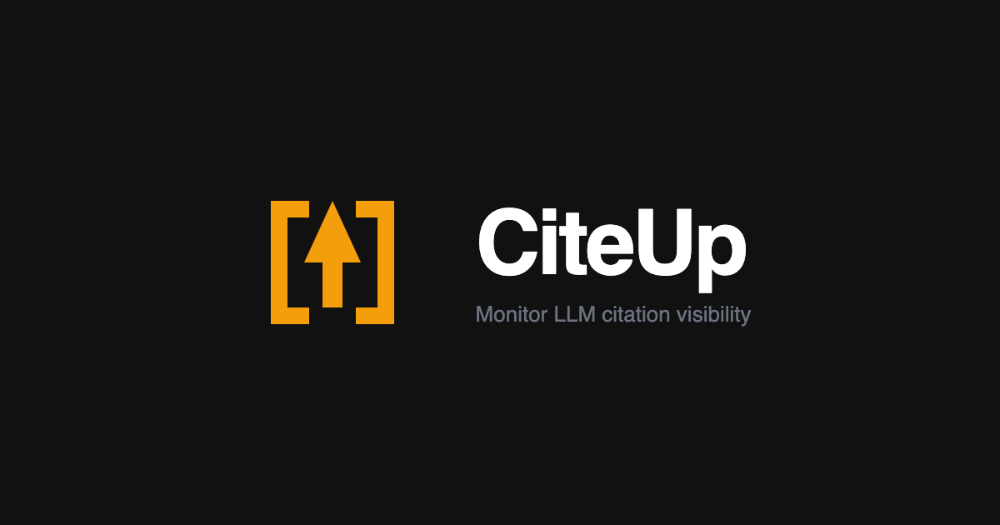

# CiteUp

**Monitor your brand's visibility in AI-generated responses.**

CiteUp tracks when and where AI platforms — ChatGPT, Claude, Gemini, Perplexity — cite your website in their answers. Think of it as Google Search Console, but for LLMs.

## What it does

CiteUp runs predefined search queries against major AI platforms (with web search enabled) and records every citation — every URL that appears in a response. Over time you see which platforms cite you, which queries trigger citations, and how your visibility changes week over week.

## How it started

CiteUp grew out of [Rentail](https://rentail.space), a platform for finding temporary retail space in shopping centers. Users kept mentioning they'd found Rentail through ChatGPT or Perplexity, but there was no way to verify that or track it consistently. A quick monitoring script turned into a proper product when it became clear the problem wasn't unique to Rentail — every brand building an online presence needs to know whether AI platforms are citing them.

## For contributors and AI assistants

See [CLAUDE.md](CLAUDE.md) for commands, architecture, and coding conventions.
